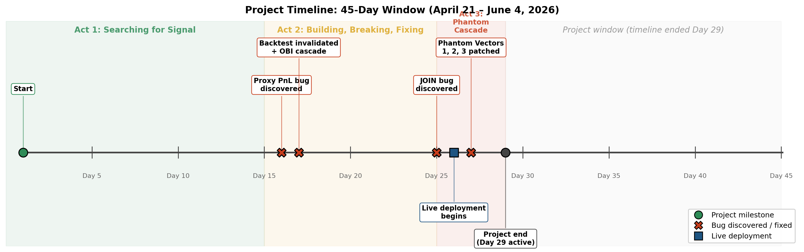

\begin{center}
\Large \textbf{Polymarket Trading Bot: A 45-Day Autopsy}

\vspace{0.3em}
\normalsize \textit{A forensic record of building, breaking, and measuring a solo trading bot project}

\vspace{0.5em}
\small May 2026
\end{center}

\vspace{0.5em}

\noindent\fbox{\begin{minipage}{0.96\textwidth}
\small\ttfamily
250+ hours of focused work.\\
2,409 wallets classified.\\
180 bots deployed.\\
417,008 paper trades simulated.\\
\$157,115 in apparent paper PnL.\\
Three classes of measurement bugs invalidated 99\% of it.\\
\$300 of real capital deployed.\\
105 live trades.\\
-\$96 net.\\
One bot, +\$2.93 across 37 fills.
\end{minipage}}

\vspace{0.8em}

\noindent\textbf{Abstract.} I deployed four trading bot architectures to Polymarket BTC 5-minute binary markets over 45 days, building 180 paper bots and 6 live bots on \$1,500 of starting capital. The fleet's apparent paper PnL of $+$\$157,115 was **inflated ${\sim}135\times$ by three classes of measurement bugs**; clean paper PnL was $+$\$1,162. Live deployment produced $-$\$96 across 105 fills. **Paper EV was anti-predictive of live EV (Spearman $\rho = -0.43$)** — the architectures my paper trading said were best performed the worst live. This document is the forensic autopsy of how that happened, the engineering lessons it produced, and the methodology I would carry into any future systems work.

## 1. Project Setup

The idea was simple. As a crypto trader, Polymarket was a natural expansion on my existing domain knowledge — not directly transferable, but I reasoned my trader intuition combined with my CS background could produce something at least decent. Starting capital was \$1,500. Hard ceiling. The window was April 21 -- June 4, 2026, a 45-day stretch spanning the two months before my college graduation. If the project didn't work in that timeframe, I had better uses of my time as a senior. **The 45-day constraint and the \$1,500 budget were the binding parameters of every decision that followed.**

I picked crypto over sports, weather, and politics for two reasons. First, the data was all on-chain and public. Sports had insider data feeds I couldn't access; weather had professional meteorologists with model access I didn't have. Crypto's edge was that everyone saw the same orderbook in real time. Second, the cadence. Polymarket's BTC 5-minute binary markets resolved every 5 minutes — 288 resolutions per day. I figured fast resolution meant fast validation, which fit the 45-day constraint better than weekly weather contracts or multi-week political markets. What I didn't realize until later: crypto markets are deeply regime-dependent. U.S. open differs from European hours, both differ from weekend volume, and a strategy that "validates in a day" actually needs weeks of data across multiple regimes to be trustworthy. The fast-cadence advantage I'd bet on was partly illusory.

The thesis was a resolution-source calibration arbitrage. BTC 5-minute binary markets on Polymarket repriced slower than Binance spot. A bot that detected BTC distance-from-open crossing a threshold could in theory buy the correct side before the Polymarket book caught up. **The primary operator I reverse-engineered was wallet 0x7347 — a \$107K lifetime PnL trader running a distance-momentum strategy on those same markets.** I also considered a weather divergence strategy in parallel (mid-tail ECMWF model divergence against Polymarket weather contracts) but abandoned it on Day 10 when no working code existed. It didn't work. Whether the edge was already priced in or my bot simply hadn't been calibrated against enough regimes to know, I can't conclude from the data I have. What I left with was a clearer understanding of how punishing real production systems are to build solo, at the cost of time and some money. The experience was worth it.

## 2. How I Worked

I had to be my own quant researcher, developer, and trader on a 45-day timeline. I needed an efficient pipeline. I built a multi-Claude workflow that turned solo engineering into something closer to a small team's output — and this is how I expect to work in any future role.

The workflow had three roles. **I was the Planner**, deciding what to build, what to debug, and how to handle problems. **Claude.ai was the Critic** — analysis, planning, and prompt construction, with explicit behavior rules to push back hard whenever my logic was weak. **Claude Code was the Executor** — running code, debugging, and file operations on the VPS. That way I always had triangulation: no single source of truth, no single point of failure in the reasoning.

{width=82%}

The infrastructure that made this work was state management across the agents. Claude Projects held two files: `context.md` (project framing plus a Day 1-45 timeline I updated constantly) and `scope.md` (current day's priorities and next few days' plans). Claude Code had its own `CLAUDE.md` file in the VPS workspace, updated whenever the project state changed, so the executor never operated on stale context. The Critic and the Executor stayed in sync because the human Planner kept the state files current. **The two-Claude workflow is itself an artifact of this project worth noting. It's how a solo engineer can run distributed-systems work at scale without a team.**

## 3. Act 1 — Searching for Signal (Days 1-15)

### 3.1 Wallet scraping and the ranking problem

The reverse-engineering approach was inspired by my prior project Aether, which had been an LLM workflow engine for messy financial documents. Same architecture, different domain: classify operators, identify behavioral patterns, extract their edge.

I used Dune Analytics to scrape the top wallets active in the last 30 days — minimum 300 trades, recent activity, in crypto/weather/finance categories. I hit the monthly query cap and had to upgrade to a paid subscription. The scrape produced 3,675 wallets ranked by "alpha" (sharpe $\times$ PnL), with the lowest-variance highest-equity-curve bots at the top. This ranking introduced a noise source I didn't recognize at the time: low-cadence bots took fewer trades and therefore had lower total PnL, which buried weather operators around rank 1,000 while filling the top 500 with high-frequency crypto bots. **The ranking formula was making a strategy choice for me that I hadn't intended.**

I scraped the full transaction history of the top 2,500 wallets. The initial JSON format hit 60GB at 1,200 wallets and consumed all available disk space — I rescraped using a slim JSON format to fit. 91 wallets had 200K-1M+ trades in 30 days alone; I excluded these from the automated pipeline and flagged them for manual review later. That left 2,409 wallets going into classification.

With classifications underway, I needed to choose specific operators to reverse-engineer. The obvious approach was top-N by alpha — pick the top 10 wallets and study them. I didn't do that. The top-100 was homogeneous: locked-out archetypes I couldn't compete with (sports market-makers running rebate-optimized strategies, crypto binary specialists with sub-100ms execution loops). Copying any of them required execution speed I couldn't match on a \$1,500 budget. Instead I sampled across the rank distribution — 6 strata covering top-10, ranks 50-100, 400-600, 1000-1200, 1500-1715, plus a random control set. Each stratum got the same depth of analysis. The hypothesis was that the ranking formula was a hypothesis generator masquerading as truth, and that interesting operators were hiding outside the top.

That's how Brokie surfaced. Rank ${\sim}1{,}600$ of 2,409. \$453K in positions across a 25-month observation window. The strategy was a sum-constraint basket — low-frequency, high-conviction, multi-event positioning that the alpha formula (sharpe $\times \sqrt{\text{resolved\_markets}}$) had buried because the $\sqrt{\text{resolved\_markets}}$ term penalized exactly the low-frequency strategy that made Brokie profitable. **The ranking formula had hidden the most interesting operator in the dataset. Stratified sampling found them.** If I'd used top-N selection, I would have spent the project trying to clone a sports market-maker whose edge was 50ms execution latency I didn't have.

> **Lesson.** When your ranking function is also your hypothesis generator, top-N selection guarantees you confirm your priors. Stratified sampling across the rank distribution is cheap insurance against the formula hiding what you needed to find.

### 3.2 The 3-tier LLM classification pipeline

For those 2,409 wallets, I built a tiered LLM classification pipeline designed around cost architecture, not just quality. Layer 1 used Haiku to classify each wallet into a rough archetype based on trade history. The first pass surfaced multiple data issues — I'd missed the "rebate" field (maker rewards, critical for market-maker classification), and the PnL figures I'd computed didn't match Polymarket's actual analytics. I rescraped using Falcon API (the data source Polymarket Analytics itself uses) and re-ran Layer 1. Two duplicate runs and one full rescrape later, I had 2,409 wallets classified into 11 archetypes for about \$8.

The exemplar of why Layer 1 wasn't enough was ColdMath. Layer 1 had classified ColdMath as `crypto_bins`. I knew ColdMath was actually a weather operator — 96.2% of their USDC volume was in weather markets, with a distinct timing peak at the ECMWF-00Z model run release. The classifier had it wrong by every metric I cared about. My instinct was to debug the classifier. The actual error wasn't in the classifier. The Layer 1 feature set didn't include weather-specific signals (volume share by market category, timing relative to data releases). The classifier was making the best inference available from the data it had. **The data pipeline had been the problem, not the model.**

Layer 2 was a richer second pass on the 1,100 wallets that looked interesting after Layer 1. It used a 32-column feature pipeline (19 original plus 13 second-pass features including the rebate corrections and additional behavioral signals) and routed between Haiku and Sonnet depending on classification confidence. Layer 2 ran in a single attempt with grounding techniques — a lesson learned from Layer 1. I fed it known sub-archetypes as anchors and provided explicit examples of edge cases. Layer 2 classified ColdMath correctly. The 15.5% reclassification rate from Layer 1 to Layer 2 confirmed the second pass was doing real work. The most useful feature additions were Brier score (calibration quality of directional predictions), maker share (percentage of trades on the maker side of the book), and directional win rate (separately for buy-side and sell-side fires). Together, these three axes separated four distinct archetypes: calibrated directional traders (low Brier, low maker share, mixed-direction WR), market makers (high maker share, high directional WR from rebates), degenerate retail (high Brier, mixed everything), and weather/sum-constraint operators (distinct pattern based on basket structure).

Layer 3 was the final selection pass. I took the candidates that survived stratified sampling (Brokie among them) and ran deep analysis using Opus through my Claude Max plan, looking for replicable behavioral patterns and edge structures small enough that a solo developer could implement them. Because I was on Claude Max rather than API credits, Layer 3 didn't add direct cost — the depth of analysis would have cost hundreds of dollars on direct API. Cost for Layer 2 was roughly \$10-12. Total LLM spend across Layers 1 and 2 was estimated at \$18-20 but actually came in closer to \$30-40 between the duplicate runs and rescrapes. Running the same workload on Opus throughout would have cost ${\sim}$\$150. **The tiered design was cost architecture, not just quality optimization — a \$1,500-budget project couldn't have absorbed a \$150 classification bill.**

> **Lesson.** When a classifier "fails" on labeled data, check whether the failure is in the model or in the features the model was given. Models can only infer from what they see. The ColdMath error wasn't a model error — it was a data pipeline error that the model couldn't fix on its own.

## 4. Act 2 — Building, Breaking, Fixing (Days 15-25)

### 4.1 Infrastructure and the 180-bot fleet

The starting foundation was difficult. I knew what category I wanted to do (crypto or weather) but Polymarket was banned in America. I had locally logged crypto and weather data on my desktop, which meant keeping it on all night while I slept just to keep the live loggers running. On Day 5 I was so irritated by the fan noise that I switched to a VPS. The real reason was that local logging tied my data integrity to my desktop's uptime, but the fan noise was what finally pushed me to fix it.

The VPS choice was more complicated than picking any VPS. A fleet of bots and loggers takes heavy load on each server, and I needed multiple VPSes for different roles. I initially used Binance.US for prices but realized the liquidity was almost 10$\times$ less than Binance Global. Binance Global was geo-blocked from America, so I needed a VPS that could fetch Binance prices at low latency: an 8 GB / 4 vCPU instance in Frankfurt. Live trading was a separate problem because Frankfurt was also geo-blocked from Polymarket. I needed a different VPS for live bots — sharing the load between paper and live execution was risky. If the live VPS failed I could lose money. If the paper trading VPS failed I lost data and time, but not capital. I decided on a 1 GB / 1 vCPU VPS in Amsterdam. Amsterdam was the lowest-latency choice for the two data centers I needed: Binance Global in Asia, Polymarket CLOB in Europe. Amsterdam sat closer to both than any US option that wasn't geo-blocked.

{width=92%}

Once the infrastructure was stable, the actual bot work began. I built 180 paper trading bots across the project — 19 operational at the end, 161 pruned along the way. Each generation reflected a hypothesis revision: V3 was the initial reverse-engineering of operator 0x7347's edge grid; V5 introduced execution refinements; V8 tested aggressive sizing; V5c rolled back to a validated baseline once the proxy bug invalidated everything I'd done in V6-V8. By Day 17 I had a working baseline (v5c\_clean) and needed to figure out which parameters mattered.

The answer was a 27-variant single-axis sweep. One baseline plus 27 variants, each differing from baseline on exactly one parameter. Axes tested: threshold (5 variants), crossing lookback (4), TAIL handling (3), exposure cap (1), oscillation gate (1), execution mechanism (2), sizing (5), BIAS revival (1), hedge zone bounds (3), and hedge tuning (2). Each variant ran in parallel on the Frankfurt VPS, all feeding the same fleet.db. The statistical framework was explicit: $N=100$ minimum fires per variant before drawing conclusions, Bonferroni correction at $\alpha = 0.05/27 \approx 0.00185$ per comparison, and zone-level effects compared rather than bot totals.

The 27-variant sweep produced architecture-specific bots that lasted into the late project: a "keep list" of 22 conviction, regime, sniper, and uniform\_dist variants, plus 4 ohanism and 2 reversion bots that survived their own pruning rounds. fleet.db accumulated 417,008 paper fires across 91,059 windows by the end. In retrospect, the sweep was both right and wrong. Right: single-axis variants gave interpretable results when the underlying data was clean. Wrong: the underlying data was not clean. The proxy bug had corrupted ranking comparisons before Day 16. The phantom vectors corrupted the sweep itself starting Day 13 or so. I was optimizing parameters against data that was 80%+ phantom in some cohorts. **The methodology was sound. The substrate it ran on was lying. I would not build 180 bots again.**

> **Lesson.** Methodological rigor doesn't save you from corrupted data. Statistical frameworks (Bonferroni correction, minimum $N$, zone-level comparison) are necessary but not sufficient — they assume the input data is real. When the inputs are wrong, the rigor compounds the error rather than catching it.

### 4.2 The proxy PnL bug (Day 16)

\textit{All my bots looked successful by every metric. The numbers were too clean. I picked one window manually, a bot that shouldn't have been profitable, and the proxy reported 75\% ROI on a \$40 position with no edge. I started recomputing.}

The core signal of my trading bot was momentum. My signal was an edge grid of distance $\times$ momentum, modeled after an elite operator's strategy I'd reverse engineered. I built a fleet of bots that fired paper trades using Polymarket CLOB data and Binance WebSocket feeds for BTC spot prices. The fleet was putting up massive numbers. Every bot's EV was so high that compounding the gains projected an exponential equity curve. That's what the elite operators' curves looked like. Mine had the same shape. I thought I'd cracked it early.

On Day 16 I picked one winning window and recomputed the PnL by hand. The formula was wrong. I'd been computing gross PnL as `net_yes_usdc - net_no_usdc` (or the inverse, depending on which side resolved). The correct formula was `(shares - shares × price - fee)` for wins and `(-shares × price - fee)` for losses. Polymarket binary contracts have asymmetric payoff structure that I'd forgotten about. A 20¢ contract pays \$0.80 on a win — 400% upside. An 80¢ contract pays \$0.20 on a win — 25% upside. My formula treated both as if they paid the full cost basis.

Once I applied the fix, the fleet flipped from overwhelmingly positive to overwhelmingly negative. Overstatement scaled with entry price: 1.4$\times$ at 55-65¢, 3.5$\times$ at 65-85¢, ${\sim}9\times$ at 85-95¢. On one mixed-side window, the proxy reported a \$13.35 win. The corrected formula showed a \$12.92 loss. **Sign flip. Fourteen days of architectural decisions had been made on inflated numbers.** V5c had been promoted to PRIMARY based on metrics that didn't exist. I felt defeated. Part of me had always suspected it was too easy. The backtests had overfit, the overfitting had inflated the fleet's apparent edge, and I'd built fourteen days of work on a metric that lied. I moved on. This was the first of three bug classes that would eventually invalidate most of the data.

> **Lesson.** Measurement instruments need validation gates separate from the strategies they measure. The proxy formula was approximately right at near-50¢ entries, the crossover point where it equals true PnL, which gave it false credibility. A single test case at 80¢ would have caught it on Day 1.

### 4.3 Two methodology failures (Day 17)

Day 17 was the first day I truly learned that my data was potentially contaminated everywhere. For my backtests I had scraped 1-second BTC history from Binance spanning multiple months — June to September 2025 and January to April 2026. I had the core signal: persistence $\times$ distance of BTC from opening price. I needed the system to back up the signal, which led me to backtest different strategies. One of the parameters I'd been backtesting was CROSSING\_LOOKBACK, which checked for oscillating patterns in the last $N$ seconds. My bot was effectively a momentum bot, and ranging price action was bad for the strategy, so the lookback gated firing during oscillation periods.

The backtesting showed 40 seconds was optimal. My original bot used 60 seconds. I believed the backtest and switched. In paper trade, the change produced a 12.5pp regression in win rate — V5c's 60-second lookback hit 79.2%; the backtested 40-second version hit 66.7%. Backtesting was no longer viable. Too much noise, too many factors I couldn't model. The new methodology: use backtesting to generate rough numbers and hypotheses, but prove them through paper trading.

The same day, I learned to distrust my own restart wrappers. My paper bots consumed orderbook imbalance (OBI) data from a dedicated logger process running on the Frankfurt VPS — `obi_logger_v3` pulled Polymarket orderbook depth continuously and wrote OBI features to disk at ${\sim}12$ rows per second. Every paper trader had a startup check, `check_loggers(fatal=True)`, that called `sys.exit(1)` if the most recent OBI row was stale. The check was designed to prevent bots from trading on outdated orderbook state. At 21:47 UTC the OBI logger died. I hadn't wrapped it in a while-true restart loop, so when it died, it stayed dead.

The paper traders, on the other hand, were wrapped in while-true loops. Each one restarted every 5 seconds. On restart, the bot checked OBI freshness, found it stale, called `sys.exit(1)`, and the wrapper restarted it. The cycle ran for two hours across 8 paper traders. **The stderr logs were completely clean the entire time** — `sys.exit(1)` is an intentional exit, not an exception, so it produced no error output. From a stderr-checking perspective, every bot looked healthy. None of them were trading. I only noticed when I checked the CSV outputs and realized no new data had been written in hours.

The fix was two parts. I wrapped the OBI logger in a while-true loop with the same restart pattern the bots used. I also changed the health check methodology: stderr cleanliness alone was no longer sufficient. The new verification required three signals together: process running, stderr clean, AND observable output (CSV writes, fleet.db inserts) within the last $N$ minutes. The single biggest lesson from the day: **a restart wrapper that hides a permanent failure behind successful restarts is dangerous by design.** The bots looked alive because the wrapper kept reviving them. They weren't alive. They were stuck in an endless loop in limbo.

> **Lesson.** Backtests systematically overstate edge in microstructure-dependent strategies. Only live execution discriminates. And stderr cleanliness is not a health signal — observable output is. Restart wrappers that hide permanent failures behind successful restarts are dangerous by design.

## 5. Act 3 — Phantom Cascade (Days 25-29)

### 5.1 Vector 3: the default value phantom

By Day 27 I'd been hunting a class of phantom-fire bugs for two days. The pattern was a shared helper function that returned stale or wrong market data when primary lookups failed — when called inside the wrong context, the helper would adopt a different market's identifier and let the bot fire on that market's prices instead of the one it was supposed to be tracking. I'd patched two instances of this pattern by Day 27 morning, both gated by the same condition (`window_second < 60`). A canary test had confirmed both fixes worked, and I thought the phantom class was closed.

Vector 3 was different. **The CID was correct. The market identifier was correct. Only the price was fabricated.** That's why nothing I'd built to catch the first two vectors saw it.

\textit{Day 27 of 45. I had been debugging the depth logger for hours. I saw the line: \texttt{if yes\_bid is None or yes\_ask is None: yes\_mid = 0.5}. Every empty book defaulted to 50 cents. It was 5 am. My heart sank. I turned off my computer and went to sleep.}

My fleet was using distance — a measure of BTC price movement % — to target mispricing in the binary market. When BTC moved by a given %, the market sometimes mispriced its implied probability. The metrics were great. The late-resolution bots — bots that bought cheap contracts near the window's resolution — were showing daily profits in the thousands. It was believable since the strategy was derived from real operator behavior I had reverse engineered. Average fill price of 50¢ one minute before window resolution. I thought I'd finally figured it out. Everything looked good, so I deployed a variant from paper to live.

The live bot, the same architecture that had shown 100% fill accuracy and 90% ROI in paper, didn't fire once in 24 hours. I audited the logic, the order construction, the fill mechanics. I blamed latency. I blamed fill rate. None of it explained the silence. Then I looked at the depth logger. When one side of the Polymarket order book was empty, the logger wrote `yes_mid = 0.5` as a default placeholder instead of `None`. My paper trader read that default as a real mid-price. My late-window bots had been firing on fake 50¢ prices in markets where the real price was already 0.99 or 0.01 — markets that had already resolved in one direction.

Every late-window fire in my paper data was a phantom. The live bot waited for the same conditions and never found them. They didn't exist. The only reason I caught it was the WS shadow feed — a parallel Polymarket CLOB WebSocket persisting orderbook snapshots to a second log independent of the paper trading data pipeline. Any suspect paper fire could be looked up against the real CLOB ask at that timestamp from the shadow log. When the paper price diverged from the shadow price, the fire was phantom. Most of my fleet was built around this signal. **The signal had a 99% phantom rate.** This was worse than the proxy bug. Two weeks of paper data, contaminated. The live fleet couldn't fire a real buy. I had no clean data and no working strategy. Less than two weeks left until the timeline closed and graduation arrived. The project was effectively over.

> **Lesson.** Default values in shared infrastructure are the most dangerous code you write. They fail silently in exactly the conditions where you need them most.

### 5.2 What the clean data showed

With the three vectors patched and the WS shadow feed confirming 0% phantom rate, I could finally ask what the fleet had actually been doing. The clean data made three things visible at once: what the contamination had cost, what the strategy actually did under live execution, and a paradoxical relationship between paper and live results that the phantom-inflation story explained.

**The contamination cascade.** Pre-V3-fix, the fleet showed 399,395 fires and $+$\$157,115 of apparent PnL. Post-V3-fix, the same fleet on the same time period showed 17,288 fires and $+$\$1,162. **The inflation factor was ${\sim}23\times$ on fire count and ${\sim}135\times$ on PnL.** Most of the apparent profit had been phantom fires firing at fake 50¢ prices in markets that had already resolved. The 8 "top-performing" uniform\_dist bots told the story most cleanly. Pre-fix, they collectively logged 10,603 fires and $+$\$72,924 in apparent PnL — they had been the leaderboard. Post-fix, they collectively logged 31 fires across all 8 bots. Bots that had been doing 500-2,300 fires each were now doing 1-7. **The top of the leaderboard had been fabricated, in full, by the empty-book phantom.**

{width=98%}

**The live deployment.** I deployed 6 architectures to Amsterdam VPS over ${\sim}35$ hours (May 11-13). The live fleet produced 105 resolved fills and $-$\$81.44 in trading PnL, or $-$\$96 total including slippage from short-lived experimental bots. Of \$300 deployed, \$204 was withdrawn at project close. One bot was profitable. **`sniper_tight_a_only` produced 37 fills, $+$\$2.93, and a 70.3% win rate.** At $N=37$ the 95% confidence interval on EV/fill spans roughly $[-$\$$0.40, +$\$$0.56]$ — the result is indistinguishable from zero. The paper version of the same architecture had paper EV of $+$\$0.00 at $N=77$. Both were indistinguishable from zero. **The agreement between paper and live, for this one architecture, was the cleanest signal of the project: both metrics agreed there was no edge to detect.**

\begin{table}[h]
\centering
\caption{Live PnL by bot architecture, ${\sim}35$ hours on Amsterdam VPS (May 11-13).}
\small
\begin{tabular}{lrrrrr}
\hline
\textbf{Bot} & \textbf{Fills} & \textbf{Wins} & \textbf{WR\%} & \textbf{PnL} & \textbf{EV/fill} \\
\hline
live\_sniper\_tight\_a\_only & 37 & 26 & 70.3\% & +\$2.93 & +\$0.08 \\
live\_reversion\_01\_45\_d4 & 2 & 1 & 50.0\% & +\$0.49 & +\$0.25 \\
live\_conviction\_v1 & 2 & 1 & 50.0\% & -\$1.80 & -\$0.90 \\
live\_surgical & 11 & 4 & 36.4\% & -\$6.70 & -\$0.61 \\
live\_ohanism\_loose\_bilateral & 32 & 14 & 43.8\% & -\$16.31 & -\$0.51 \\
live\_barbell & 21 & 9 & 42.9\% & -\$60.05 & -\$2.86 \\
\hline
\textbf{TOTAL} & \textbf{105} & \textbf{55} & \textbf{52.4\%} & \textbf{-\$81.44} & \textbf{-\$0.78} \\
\hline
\end{tabular}
\end{table}

**The anti-prediction finding.** Across the 6 deployed architectures, the Spearman rank correlation between paper EV and live EV was $\rho = -0.43$. **Paper EV was not predictive of live EV; it was inversely predictive.** The two highest-paper-EV architectures (conviction at $+$\$1.16/fire, barbell at $+$\$0.48/fire) produced the worst live results per fill ($-$\$0.90 and $-$\$2.86 respectively). The break-even paper bot (sniper, paper EV \$0.00) was the only profitable live performer. The only paper-negative bot (surgical, $-$\$0.18) stayed negative live ($-$\$0.61). The pattern was consistent with the contamination story: paper bots that fired more aggressively had picked up more phantom fires, which inflated their paper EV with trades that didn't exist on real orderbooks. **The architectures that looked best on paper had been the most phantom-contaminated.** When deployed live, those architectures had no real edge to capture — they had been optimizing for fires that didn't exist. The bots whose paper EV was closest to zero were the only ones whose paper signal was honest enough to survive contact with live execution. **They weren't profitable. But they weren't lying either.**

{width=72%}

\begin{table}[h]
\centering
\caption{Paper-to-live comparison across 6 architectures. Spearman $\rho = -0.43$.}
\small
\begin{tabular}{lrrrrrrl}
\hline
\textbf{Architecture} & \textbf{P. N} & \textbf{P. EV} & \textbf{P. WR\%} & \textbf{L. N} & \textbf{L. EV} & \textbf{L. WR\%} & \textbf{Direction} \\
\hline
Barbell & 128 & +\$0.48 & 87.5\% & 21 & -\$2.86 & 42.9\% & reversed \\
Surgical & 65 & -\$0.18 & 78.5\% & 11 & -\$0.61 & 36.4\% & matched \\
Sniper & 77 & +\$0.00 & 66.2\% & 37 & +\$0.08 & 70.3\% & ambiguous \\
Reversion & 1,232 & +\$0.20 & 46.3\% & 2 & +\$0.25 & 50.0\% & matched \\
Ohanism & 1,021 & +\$0.09 & 67.0\% & 32 & -\$0.51 & 43.8\% & reversed \\
Conviction & 393 & +\$1.16 & 80.2\% & 2 & -\$0.90 & 50.0\% & reversed \\
\hline
\end{tabular}
\end{table}

**Synthesis.** The project's only real convergence was between paper and live measurements at the end. 26 days of optimization had been optimization against inflation, not against signal. Strip the artifacts away and the whole project was me optimizing an almost identical paper trading simulator. Instead of calibrating and finding signal, I was inadvertently calibrating my measurement instruments — they became hyper-accurate at the cost of revealing there was no profitable signal underneath. **What I had, at the end, was a clean measurement pipeline with nothing in it.**

> **Lesson.** Paper EV was anti-predictive of live EV in this fleet ($\rho = -0.43$). The pattern is consistent with phantom contamination: aggressive-firing architectures picked up more phantoms, inflating apparent paper edge with trades that couldn't happen live. The bots closest to paper break-even were the only ones whose paper signal had been honest enough to predict live performance.

## 6. What I Would Have Done Differently

- **Built the WS shadow ground truth on Day 1, not Day 26.** Less than an hour to deploy. Would have caught all three phantom vectors weeks earlier, before 400K phantom fires had corrupted the analysis. This single change would have changed almost every conclusion downstream.

- **Would not have built 180 bots.** The 27-variant sweep optimized parameters against data that was 80%+ phantom in some cohorts. A 5-bot sweep with ground-truth verification on Day 1 would have produced more reliable findings than the 180-bot fleet produced over 26 days. The methodology was sound; the substrate it ran on was lying.

- **Built the measurement validation framework on Day 1.** The proxy PnL bug (Day 16) and the JOIN bug (Day 25) both persisted for days because no independent verification of metrics against raw data existed. A single "recompute three windows by hand" check would have caught the proxy bug on Day 1 instead of Day 16.

- **Deployed live bots earlier with smaller share sizes.** Live deployment started Day 26. In ${\sim}35$ hours it produced 105 trades of real signal — more diagnostic value per trade than any paper data point. Starting on Day 10 with \$50 instead of \$300 would have given me weeks of clean live data and caught the paper-to-live degradation before I'd built 180 variants on contaminated paper signal.

- **Killed the weather strategy by Day 10.** No working code existed by then. It consumed planning attention and infrastructure overhead (a NY VPS that never got used for crypto) without producing artifacts. The sunk-cost holding kept it alive longer than the evidence justified.

## 7. What I Would Have Done The Same

- **Operator reverse-engineering as the starting point.** Reverse-engineering operator 0x7347's distance-momentum edge gave the project a concrete, falsifiable target. Better than designing from theory alone — when the bot didn't work, I had a specific reference point to compare against.

- **Stage-gated structure (calibration $\rightarrow$ validation $\rightarrow$ deployment).** The gates ($N \geq 100$ paper fires per variant, sustained WR above price-adjusted break-even, no active kill switch) prevented premature live capital deployment against phantom-inflated signals. Without them I would have deployed real money against contaminated paper data weeks earlier.

- **Single-axis variant methodology for the sweep.** Testing one parameter at a time produced interpretable results when the underlying data was clean. The fact that the data wasn't clean is a separate problem — the methodology itself was right.

- **Investment in data infrastructure.** fleet.db (417K fires, 91K windows), the phantom cleaning pipeline, the WS shadow feed, the bug-class forensic documentation — these produced the project's most durable findings even though they didn't produce profit. The infrastructure outlasted the strategy.

- **Tiered LLM design as cost architecture.** Layer 1 used Haiku for high-volume classification (${\sim}$\$8); Layer 2 used Haiku and Sonnet for richer reclassification (${\sim}$\$10-12); Layer 3 used Opus through my Claude Max subscription for deep candidate analysis (no marginal cost). Total spend across all three layers was ${\sim}$\$30-40, against ${\sim}$\$150 if I'd run everything on Opus. For a \$1,500-budget project, that architectural decision was the difference between a viable experiment and a prohibitively expensive one. Model selection is cost architecture, not just quality optimization.

- **Documenting everything.** The forensic docs (phantom\_mechanism\_forensic.md, proxy\_pnl\_bug\_day16.md, execution\_pipeline\_setup.md, day17\_session\_summary.md) are reusable knowledge for any future work in this space. Writing as I went meant the autopsy itself was largely already drafted by the end of the project.

## 8. Lessons That Generalize Beyond Polymarket

1. **Measurement instruments need validation gates separate from the strategies they measure.** A PnL formula bug looked approximately right at near-50¢ entries (the crossover point where the wrong formula coincidentally equals the correct one), which gave it false credibility for 14 days. A single test case at 80¢ entry price would have caught it on Day 1. The principle generalizes: never let the same code path produce both the metric and the validation of the metric.

2. **Stderr cleanliness is not a health signal — observable output is.** Eight bots crash-looped for two hours with completely clean stderr. The dependency they relied on had died, the restart wrapper kept restarting them every 5 seconds, they kept exiting on stale data, and the cycle repeated invisibly. No error was logged because the exit was intentional. Process health requires three signals together: process running, stderr clean, AND observable output (writes, inserts, side effects) within the last $N$ minutes.

3. **Default values in shared infrastructure are the most dangerous code you write.** A single placeholder — `yes_mid = 0.5` for "one side of the book is empty" — was a reasonable null substitute in isolation. But downstream code used it as a real price, and the placeholder passed every gate because the market identifier was correct. The default value created a class of phantom fires that was invisible to every detection method except ground-truth price cross-reference. Sentinels that look like valid values are the failure mode; sentinels that obviously aren't valid values (None, NaN, sentinel strings) force the caller to handle them explicitly.

4. **Backtests systematically overstate edge in microstructure-dependent strategies.** Backtests assume fills at mid-price. Live execution gets FAK rejections, adverse fill prices, and orderbook depth that doesn't exist in historical data. The gap between backtested and live performance is largest in exactly the strategies where the edge depends on ephemeral microstructure conditions — which is most short-horizon strategies. Only live execution discriminates real edge from backtest fantasy.

5. **Data provenance matters as much as data quality.** A ground truth label set is only as trustworthy as its weakest provenance link. In this project, 11 of 13 supposedly "ground truth" wallets turned out to be either reconstructed from session memory after a file wipe, or circularly derived from features the classifier itself could see. Manual vetting that can't be reproduced from saved sources isn't ground truth — it's reconstructed memory. Always check provenance before trusting labels.

## 9. Final Numbers

\begin{table}[h]
\centering
\caption{Project summary metrics.}
\small
\begin{tabular}{ll}
\hline
\textbf{Metric} & \textbf{Value} \\
\hline
Starting capital & \$1,500 USDC (\textasciitilde\$300 funded to live wallet) \\
Project duration & 29 days active / 45-day window (Apr 21 -- Jun 4, 2026) \\
Wallets scraped and classified & 2,409 \\
Total bots built (paper) & 180 (19 operational, 161 pruned) \\
Total paper fires (raw) & 417,008 \\
Paper PnL (pre-V3-fix, contaminated) & +\$157,115 across 399,395 fires \\
Paper PnL (post-V3-fix, clean) & +\$1,162 across 17,288 fires \\
Inflation ratio (paper PnL) & \textasciitilde135$\times$ \\
Live bots deployed & 6 \\
Live fills (all resolved) & 105 \\
Live PnL (6 production bots) & -\$81.44 \\
Total real-money trading cost & -\$96 \\
Best live bot & sniper\_tight\_a\_only: +\$2.93 / 37 fills / 70.3\% WR \\
Worst live bot & live\_barbell: -\$60.05 / 21 fills / 42.9\% WR \\
Spearman $\rho$ (paper EV vs live EV) & $-0.43$ \\
Live deployment window & May 11 15:30 -- May 13 02:15 UTC ({\textasciitilde}35h) \\
\hline
\end{tabular}
\end{table}

\begin{table}[h]
\centering
\caption{Operational costs.}
\small
\begin{tabular}{lr}
\hline
\textbf{Category} & \textbf{Cost} \\
\hline
VPS infrastructure (DigitalOcean, 3 droplets) & \$41.35 \\
Claude API (LLM wallet classification pipeline) & \$51.03 \\
Claude Max subscription & \$200 (1 billing cycle) \\
Free APIs (Falcon, Dune, Alchemy, Polymarket, Binance, Open-Meteo, NOAA) & \$0 \\
\textbf{Total operational cost} & \textbf{\textasciitilde\$292} \\
Live trading loss & -\$96 \\
\textbf{Total project cost} & \textbf{\textasciitilde\$388} \\
\hline
\end{tabular}
\end{table}

Project cost relative to \$1,500 starting capital: ${\sim}19.5\%$ spent on infrastructure and AI tooling, $6.4\%$ on trading losses. The remaining capital was preserved.

\clearpage

## 10. Limitations

Honest bounds on what this autopsy proves.

- **Single capital pool.** Everything happened on \$1,500 starting capital. Larger accounts might access different fill mechanics, less adverse selection, and reduced execution friction. The conclusions about paper-to-live degradation may not generalize to capital scales 10$\times$ or 100$\times$ larger.

- **45 days isn't enough for regime-dependent crypto.** BTC behavior differs across US/EU/Asia trading hours and across weekday/weekend volume patterns. A strategy that "validates in a day" actually needs weeks of data across multiple regimes to be trustworthy. My live deployment covered ${\sim}35$ hours, which crosses fewer than 2 regime boundaries.

- **Small live $N$.** 37 fills on the one profitable bot is not enough to confirm an edge — the 95\% CI spans $[-$\$$0.40, +$\$$0.56]$, straddling zero. The honest answer is "insufficient data to disambiguate small real edge from lucky variance."

- **No latency benchmarking.** I never measured my execution latency against elite operators on the same markets. Some of the "anti-prediction" pattern may be a latency effect (slower execution = adverse fill prices) that I can't separate from the phantom-contamination explanation.

- **Phantom contamination dates back to Day 13.** Every backtest-derived finding in this document inherits some uncertainty from the fact that phantom fires were contaminating paper data starting around Day 13, including the architectural decisions that produced the V3-V8 fleet evolution.

## 11. What's Next

I'm not continuing the trading bot. The strategy produced no detectable edge in 45 days, and pushing it forward would be sunk-cost holding rather than evidence-based iteration. What I'm taking with me are the durable outputs: the LLM classification pipeline architecture, the WS shadow ground truth approach, the bug-class forensic documentation, and the engineering discipline of debugging silent failures in messy distributed systems. **I'm applying these to my next project and to whatever role I take after graduation — wherever verification matters as much as inference.**

\newpage

## Appendix: Reproducibility and Sources

The full project produced a forensic record across multiple artifacts. The autopsy above is the human-readable distillation; the artifacts below are the underlying material that supports every claim.

### Primary data sources

- **fleet.db** — Paper trading database pulled from Frankfurt VPS on May 13, 2026. Contains 417,008 paper fires across 91,059 windows for all 180 bots, both pre- and post-V3-fix.
- **live\_state.db** — Live execution database pulled from Amsterdam VPS on May 13, 2026. Contains all 105 resolved live fills across the 6 production live bots, plus test orders and short-lived experimental bot fills.
- **Wallet classification dataset** — 2,409 wallets scraped via Falcon API and Dune Analytics, classified into 12 archetypes across Layer 1 and Layer 2 of the LLM pipeline.

### Forensic documentation

- `Strategy/proxy_pnl_bug_day16.md` — Day 16 bug discovery, formula derivation, blast radius analysis, three-stage rollout plan
- `Strategy/phantom_mechanism_forensic.md` — Phantom Vectors 1, 2, 3 mechanism analysis with code-level reproduction
- `Strategy/day17_session_summary.md` — Day 17 methodology pivot (backtest demotion, three-step health verification)
- `Strategy/execution_pipeline_setup.md` — Multi-VPS infrastructure decisions, geo-blocking constraints, WS shadow feed architecture
- `projectscope.md` — Project-level strategy framework and phase gates

### Reproducibility

The two data figures in this autopsy (Figure 3: PnL inflation over time; Figure 4: Paper EV vs Live EV scatter) are generated by matplotlib scripts that query fleet.db and live\_state.db directly. The diagrams (Figure 1: timeline; Figure 2: workflow; Figure 3: infrastructure) are also generated programmatically. All figure-generation scripts will be published alongside this document in the project repository.

\vspace{0.8em}
\noindent\rule{\textwidth}{0.4pt}
\vspace{0.3em}

\noindent\small \textit{Polymarket Trading Bot Autopsy — May 2026 — End of document.}
